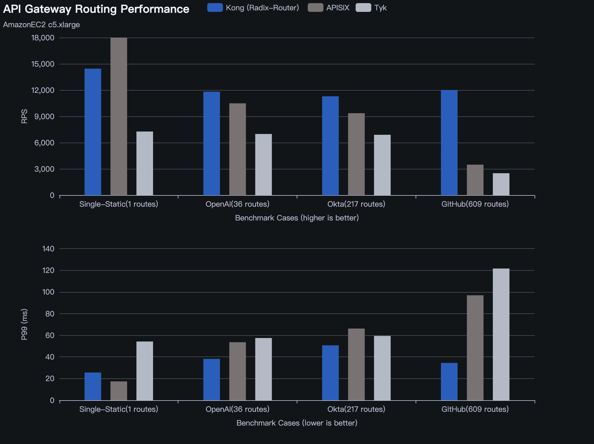

# API Gateway routing benchmark

This benchmark tool compares the routing performance of different API Gateways in multiple real-world scenarios.


#### Tested API Gateways

-   [Kong](https://github.com/Kong/kong) (with [lua-radix-router](https://github.com/vm-001/lua-radix-router))
-   [APISIX](https://github.com/apache/apisix)
-   [Tyk](https://github.com/TykTechnologies/tyk)


#### Test data

-   **Single Static API:** This has only one single static route `/api`. The benchmark result represents the pure proxy performance without involving too much routing.
-   **Statis API:** Consists of 100 static routes. (TDB)
-   **OpenAI API:** Consists of 36 routes from [openapi/openai-openapi/openapi.yaml](https://github.com/openai/openai-openapi/blob/master/openapi.yaml). A small set of APIs containing both static and dynamic paths. This represents a scenario defining a small number of APIs in gateway.
-   **Okta API:** Consists of 217 routes from [okta/okta-management-openapi-spec/resources/spec.yaml](https://github.com/okta/okta-management-openapi-spec/blob/master/resources/spec.yaml). A medium number of APIs.
-   **Github API:** Consists of 609 routes from [api.github.com.yaml](https://github.com/github/rest-api-description/blob/main/descriptions-next/api.github.com/api.github.com.yaml). The characteristic of the data is that most of the APIs share the same dynamic prefix `/repos/{owner}/{repo}/`. It's challenging for routing algorithms to locate the right API by leveraging the static sub-path.

## Motivation

Many API Gateways claim they have excellent performance based on benchmarks, which is usually not wrong. However, these benchmarks typically imply the proxy performance, which may not accurately reflect the performance in real-world scenarios. The overall performance of API Gateway does not hinge on one component, but also on others.


Router is one of the key components of API Gateway. Its performance mainly depends on the adopting algorithm and optimization techniques. The performance gap between different Routers can surpass the sum of all other components. An efficient Router enables an API Gateway to maintain close to the benchmark performance in any routing scenario.

## Results

**Benchmark System:**

-   **Platform:** Amazon EC2 c5.xlarge
-   **OS:** Ubuntu 22.04
-   **Softwares:** Docker 26.0.0, wrk 4.1.0



## Usage

### Prerequisites

- [Docker](https://www.docker.com/)
- [wrk](https://github.com/wg/wrk)


```
$ ./benchmark.sh
```


